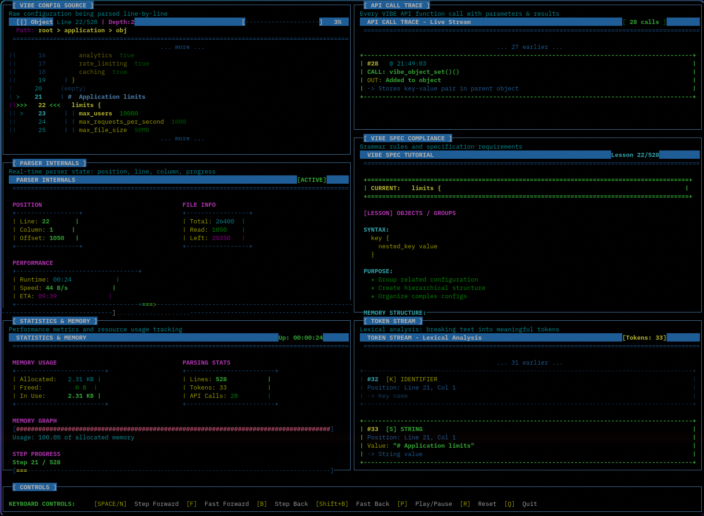

# VIBE 🌊

[](https://opensource.org/licenses/MIT)
[](https://en.wikipedia.org/wiki/C11_(C_standard_revision))
[](https://github.com/1ay1/vibe)

**VIBE** (Values In Bracket Expression) is a hierarchical configuration file format designed for human readability and fast machine parsing. It combines the visual clarity of structured formats with the simplicity of minimal syntax.

> Like its namesake, VIBE aims to create good vibes in your development workflow by eliminating the frustration of complex configuration formats. No more YAML indentation nightmares or JSON comma catastrophes - just smooth, readable config that flows naturally.

## ✨ Features

- 🎯 **Simple Syntax** - Only 5 token types, minimal punctuation
- 👀 **Visual Hierarchy** - Structure is immediately apparent
- ⚡ **Fast Parsing** - Single-pass O(n) with no backtracking
- 🔒 **Unambiguous** - One canonical way to represent data
- 💬 **Comments** - Built-in support with `#`
- 🌍 **Unicode Support** - UTF-8 strings with proper escaping
- 🎨 **Flexible Whitespace** - No significant indentation rules
- 🔧 **Type Inference** - Automatic detection of integers, floats, booleans, strings

## 📖 Quick Example

```vibe
# Application configuration
application {
  name "My Awesome App"
  version 2.1.0
  debug false
}

server {
  host localhost
  port 8080

  ssl {
    enabled true
    cert_path /etc/ssl/cert.pem
  }
}

# Server pool
servers [
  prod1.example.com
  prod2.example.com
  prod3.example.com
]

# Feature flags
features {
  new_ui true
  beta_api false
  analytics true
}
```

## 🚀 Quick Start

### Installation

```bash
git clone https://github.com/1ay1/vibe.git
cd vibe
make
```

### 🎮 Interactive Parsing Tool

VIBE includes a powerful **interactive parsing tool** with a beautiful TUI (Terminal User Interface) that visualizes the parsing process step-by-step:



```bash
make parser_tool
./vibe_parser_tool examples/simple.vibe
```

**Features:**
- 📊 Real-time visualization of parsing steps
- 🎯 Current line highlighting with yellow background
- 🔍 Token stream analysis with color-coded types
- 📚 Interactive VIBE spec tutorial that teaches as you parse
- 🔄 API call tracing with detailed parameters and results
- 💾 Memory and performance statistics
- ⏮️ Step forward/backward navigation
- 🎨 Modern card-based UI with ASCII art

**Keyboard Controls:**
- `SPACE/N` - Step forward
- `B` - Step backward
- `Shift+B` - Fast backward (rewind to start)
- `F` - Fast forward (jump to end)
- `P` - Play/Pause auto-play mode
- `R` - Reset to beginning
- `Q` - Quit

Perfect for learning VIBE syntax, debugging configs, and understanding how the parser works!

### Basic Usage

**Step 1:** Create a VIBE config file (`config.vibe`):

```vibe
# My application config
application {
  name "My Awesome App"
  version 1.0
  debug false
}

server {
  host localhost
  port 8080

  ssl {
    enabled true
    cert /etc/ssl/cert.pem
  }
}

servers [
  prod1.example.com
  prod2.example.com
  prod3.example.com
]
```

**Step 2:** Parse and use it in C (`myapp.c`):

```c
#include "vibe.h"
#include <stdio.h>

int main() {
    // 1. Create parser
    VibeParser* parser = vibe_parser_new();

    // 2. Parse the config file
    VibeValue* config = vibe_parse_file(parser, "config.vibe");

    if (!config) {
        VibeError error = vibe_get_last_error(parser);
        fprintf(stderr, "Error at line %d: %s\n", error.line, error.message);
        vibe_parser_free(parser);
        return 1;
    }

    // 3. Access values using dot notation paths
    //    Format: "object.nested_object.key"
    const char* name = vibe_get_string(config, "application.name");
    int64_t port = vibe_get_int(config, "server.port");
    bool debug = vibe_get_bool(config, "application.debug");
    bool ssl = vibe_get_bool(config, "server.ssl.enabled");

    printf("Application: %s\n", name ? name : "Unknown");
    printf("Port: %lld\n", (long long)port);
    printf("Debug mode: %s\n", debug ? "ON" : "OFF");
    printf("SSL: %s\n", ssl ? "enabled" : "disabled");

    // 4. Access arrays
    VibeArray* servers = vibe_get_array(config, "servers");
    if (servers) {
        printf("\nServers (%zu total):\n", servers->count);
        for (size_t i = 0; i < servers->count; i++) {
            VibeValue* server = servers->values[i];
            if (server->type == VIBE_TYPE_STRING) {
                printf("  %zu. %s\n", i + 1, server->as_string);
            }
        }
    }

    // 5. Clean up (frees entire config tree)
    vibe_value_free(config);
    vibe_parser_free(parser);

    return 0;
}
```

**Step 3:** Compile and run:

```bash
gcc -o myapp myapp.c vibe.c -std=c11
./myapp
```

**Output:**
```
Application: My Awesome App
Port: 8080
Debug mode: OFF
SSL: enabled

Servers (3 total):
  1. prod1.example.com
  2. prod2.example.com
  3. prod3.example.com
```

## 📚 Documentation

### Full API Reference

For complete API documentation with detailed examples, see **[docs/API.md](docs/API.md)**

**Quick Links:**
- [Parser Management](docs/API.md#parser-management) - Creating and managing parsers
- [Parsing Functions](docs/API.md#parsing-functions) - Parse strings and files
- [Value Access](docs/API.md#value-access) - Access values with dot notation
- [Object Operations](docs/API.md#object-operations) - Working with objects
- [Array Operations](docs/API.md#array-operations) - Working with arrays
- [Memory Management](docs/API.md#memory-management) - Cleanup and freeing
- [Error Handling](docs/API.md#error-handling) - Handling parse errors
- [Complete Examples](docs/API.md#usage-examples) - Full working examples

### Syntax Overview

#### Simple Assignment
```vibe
key value
```

#### Objects
```vibe
database {
  host localhost
  port 5432
}
```

#### Arrays
```vibe
ports [8080 8081 8082]

servers [
  server1.com
  server2.com
  server3.com
]
```

#### Data Types

- **Integers**: `42`, `-17`
- **Floats**: `3.14`, `-0.5`
- **Booleans**: `true`, `false`
- **Strings**: `"quoted"` or `unquoted` (for simple values)

#### Comments
```vibe
# Full line comment
key value  # Inline comment
```

#### String Escaping
```vibe
message "Hello \"World\""
path "C:\\Users\\Name"
unicode "Hello 世界"
```

### API Reference

#### Parser Management
```c
VibeParser* vibe_parser_new(void);
void vibe_parser_free(VibeParser* parser);
```

#### Parsing Functions
```c
VibeValue* vibe_parse_string(VibeParser* parser, const char* input);
VibeValue* vibe_parse_file(VibeParser* parser, const char* filename);
```

#### Value Access
```c
VibeValue* vibe_get(VibeValue* root, const char* path);
const char* vibe_get_string(VibeValue* value, const char* path);
int64_t vibe_get_int(VibeValue* value, const char* path);
double vibe_get_float(VibeValue* value, const char* path);
bool vibe_get_bool(VibeValue* value, const char* path);
VibeArray* vibe_get_array(VibeValue* value, const char* path);
VibeObject* vibe_get_object(VibeValue* value, const char* path);
```

#### Object & Array Operations
```c
void vibe_object_set(VibeObject* obj, const char* key, VibeValue* value);
VibeValue* vibe_object_get(VibeObject* obj, const char* key);
void vibe_array_push(VibeArray* arr, VibeValue* value);
VibeValue* vibe_array_get(VibeArray* arr, size_t index);
```

#### Cleanup
```c
void vibe_value_free(VibeValue* value);
```

#### Error Handling
```c
VibeError vibe_get_last_error(VibeParser* parser);
void vibe_error_free(VibeError* error);
```

### Full Specification

For the complete format specification, see [SPECIFICATION.md](SPECIFICATION.md).

## 🎯 Why VIBE?

| Feature | VIBE | JSON | YAML | TOML |
|---------|------|------|------|------|
| Human Readable | ✅ | ❌ | ✅ | ✅ |
| Minimal Syntax | ✅ | ❌ | ✅ | ✅ |
| Visual Hierarchy | ✅ | ✅ | ❌ | ❌ |
| Fast Parsing | ✅ | ✅ | ❌ | ✅ |
| No Indentation Rules | ✅ | ✅ | ❌ | ✅ |
| Comments | ✅ | ❌ | ✅ | ✅ |
| Single Pass Parse | ✅ | ✅ | ❌ | ✅ |
| No Reserved Words | ✅ | ❌ | ❌ | ❌ |

**Choose VIBE when:**
- Configuration files need to be human-readable and editable
- Fast parsing is important
- Visual structure clarity is valued
- Simple syntax is preferred
- You want to avoid indentation sensitivity (YAML) or verbosity (JSON/XML)

## 🔨 Building & Testing

### Build
```bash
make                 # Build everything
make clean           # Clean build artifacts
```

### Run Examples
```bash
make demo            # Quick demo
make test            # Run all tests
./vibe_example simple.vibe
./vibe_example config.vibe
```

### Integration

To use VIBE in your C project:

1. Copy `vibe.h` and `vibe.c` to your project
2. Add `vibe.c` to your build system
3. Include `vibe.h` in your source files
4. Link and compile with C11 support

```bash
gcc -std=c11 -c vibe.c
gcc -std=c11 -o myapp myapp.c vibe.o
```

## 📋 Examples

Check out the `examples/` directory for more usage examples:
- `simple.vibe` - Basic configuration with simple arrays
- `config.vibe` - Complex nested structure using named objects
- `web_server.vibe` - Web server configuration example
- `database.vibe` - Database configuration with replicas
- `example.c` - Complete C usage example

## 🤝 Contributing

Contributions are welcome! Please see [CONTRIBUTING.md](CONTRIBUTING.md) for guidelines.

### Areas for Contribution
- Additional language implementations (Python, Rust, Go, JavaScript)
- Schema validation tools
- Editor plugins (VS Code, Vim, Emacs)
- Conversion tools (JSON↔VIBE, YAML↔VIBE, TOML↔VIBE)
- Performance optimizations
- More comprehensive test suite

## 📜 License

This project is licensed under the MIT License - see the [LICENSE](LICENSE) file for details.

## 🗺️ Roadmap

- [x] Core parser implementation (C)
- [x] Complete specification
- [ ] Python bindings
- [ ] Rust implementation
- [ ] JavaScript/Node.js implementation
- [ ] Go implementation
- [ ] VS Code syntax highlighting extension
- [ ] Schema validation support
- [ ] Format converter tools
- [ ] Benchmark suite

## 📞 Support

- 📖 Read the [Specification](SPECIFICATION.md)
- 💬 Open an [Issue](https://github.com/1ay1/vibe/issues)
- 🌟 Star the project if you find it useful!

## 🎉 Acknowledgments

Inspired by the need for a configuration format that's:
- Simpler than YAML
- More readable than JSON
- Faster to parse than both
- More flexible than TOML

---

**Keep calm and VIBE on!** 🌊

*Configuration doesn't have to be complicated. Sometimes the best solution is the one that just feels right.*
